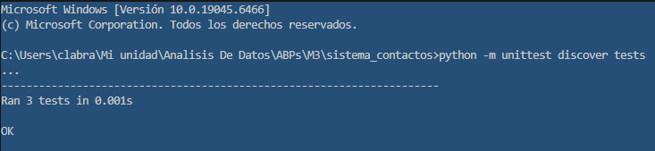

# Sistema de Gestión de Contactos

Aplicación en Python para gestionar contactos personales utilizando
Programación Orientada a Objetos.

## Funcionalidades

- Agregar contactos
- Buscar contactos
- Editar contactos
- Eliminar contactos

## Tecnologías

- Python 3
- POO
- Listas y diccionarios
- unittest

## Ejecución

python main.py

## Ejecucion de test

